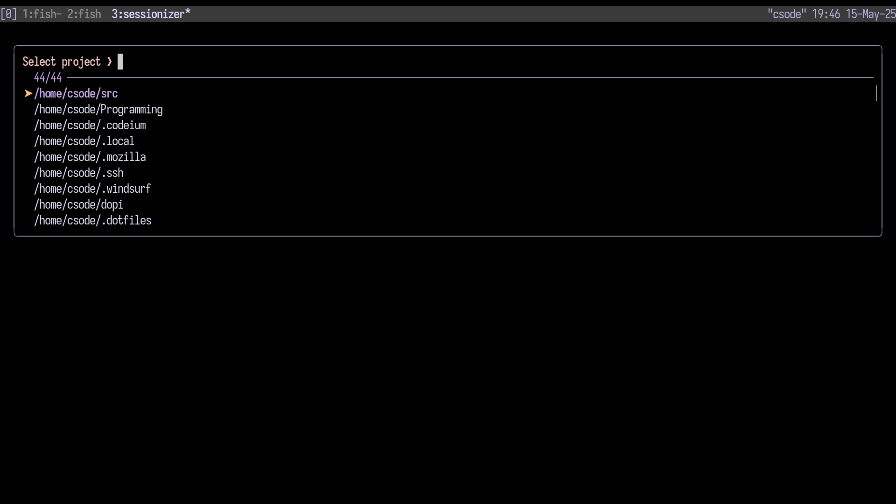

# Devenv




Personal development setup using i3Wm tmux and setup I am planning to make this its own distro with some of my own utility. This setup sure does look bad but it is focused on productivity and not asthetics.
I have recently been trying emacs I might switch we will never know.

## ChangeLog
From my previous setup certain things have changed which include my terminal, neovim config and more.
As a recap this are the changes.
- [x] Hyprland -> i3(reason webcam not working in wayland)
- [x] ghostty -> kitty(reason being nice cursor trail)
- [x] zsh -> fish(I love fish and it looked cool)
- [x] neovim -> emacs(Not a full switch it is a temporary one but love it so far)
- [x] rofi -> dmenu(I just love dmenu)

## Requirements

- Arch Linux or Arch-based distribution
- Xorg support
- Git
- [Paru](https://github.com/Morganamilo/paru) (AUR helper)

## Installation

1. Clone the repository:
```bash
git clone https://gitlab.com/tadihailukebe/devenv.git
```

2. Navigate to the directory:
```bash
cd devenv
```

3. Run the installation script:
```bash
bash script install base
```

This will install the base packages required for the environment.

## Usage

The installation script supports several commands:

- `bash script install base` - Install base packages
- `bash script install dev` - Install development tools
- `bash script install utility` - Install utility packages
- `bash script copy` - Copy dotfiles to their respective locations
- `bash script link` - Syslink dotfiles to their respective locations

## Configuration Structure

The configuration files are organized as follows:
- `dotfiles/` - Main configuration files
- `packages/` - Package installation scripts
- `wallpaper/` - Wallpaper images

## Note

This is a personal dotfile repository tailored to my specific setup and preferences. While you're welcome to use it as a reference, please be aware that:
- The configuration is minimal and may require adjustments for your needs
- Support for issues is limited to what I can provide based on my experience
- Pull requests are not accepted as this is a personal repository

## License

This project is for personal use only and is not distributed under any specific license.

