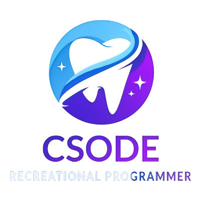

# Csode Dotfiles

<center></center>

## Quick Preview Of Script


This is a full system managment of packages and dotfiles inspired by nix on how to make Arch-based distro more stable and more configurable. 

> [!NOTE]
> This is just a personal preference meaning it is not for meant for everybody who just want their things to work.

> [!WARNING]
> All of the tools I use here are my choices so be aware that you have to do your own setup.  And this will only work for archlinux

## Introduction
This is a custom enviroment I setup for archlinux on a better use of my system. This is a customized script to automate my linux setup and make my life easier. 

## Philosophy 
The philosophy behind this system configuration is I want to have a much more modular OS and a better package managment. I have been inspired by many projects while making this project.

## Inspirations
These are the list of things I was inspired when I was making this project of dotfiles.

[Nix](https://nixos.org/): Inspiration came from making a packages.json to manage my packages so that it is modular.

[Kickstart-nvim](https://github.com/nvim-lua/kickstart.nvim.git): It was my starting point when I first started learning neovim

[DT-Emacs](https://gitlab.com/dwt1/dotfiles/-/tree/master/.config/emacs): A better emacs configuration I saw from my previous one.

## Tools I use

| Tool                                                                 | Description                    |
|----------------------------------------------------------------------|--------------------------------|
| [Paru](https://github.com/Morganamilo/paru)                          | AUR package manager            |
| [i3](https://i3wm.org/)                                              | Desktop Environment            |
| [Polybar](https://github.com/polybar/polybar)                        | Bottom Bar                     |
| [Alacritty](https://alacritty.org/)                                  | Terminal Emulator              |
| [Emacs](https://www.gnu.org/software/emacs/)                         | Text Editor                    |
| [Neovim](https://neovim.io/)                                         | Secondary Text Editor          |
| [Dunst](https://dunst-project.org/)                                  | Notification Daemon            |
| [Firefox](https://www.mozilla.org/en-US/firefox/new/)                | Browser                        |
| [Scrot](https://github.com/resurrecting-open-source-projects/scrot)  | Screenshot Utility             |
| [Fish](https://fishshell.com/)                                       | Shell                          |
| [Startship](https://starship.rs/)                                    | Terminal Prompt For Shell      |
| [Copyq](https://github.com/hluk/CopyQ)                               | For clip board copying         |
| [Tmux](https://github.com/tmux/tmux/wiki)                            | Terminal multiplexer           |
| [tpm](https://github.com/tmux-plugins/tpm)                           | Tmux plugin manager            |


## Instrcution 

To replicate my whole system it is easy to do. Follow the instrcution.


> [!WARNING]
> This will install some things like jq and dialog if they are not installed.

1. Clone the repository
```
git clone https://github.com/xsoder/env.git ~/devenv # If you got it from github

git clone https://gitlab.com/xsoder/devenv.git ~/devenv # If you got it from gitlab
```

2. Change the directory
```
cd ~/devenv
```

3. Simply run

```
bash script
```

### Dotfiles information

If you are interested in my dotfiles. Read about them in their repective direcotry.

Read About my i3 setup: [i3](./dotfiles/i3/README.md)

Read About my emacs setup here: [Emacs](./dotfiles/emacs/config.org)

Read About my neovim setup here: [Neovim](https://github.com/xsoder/nvim)
