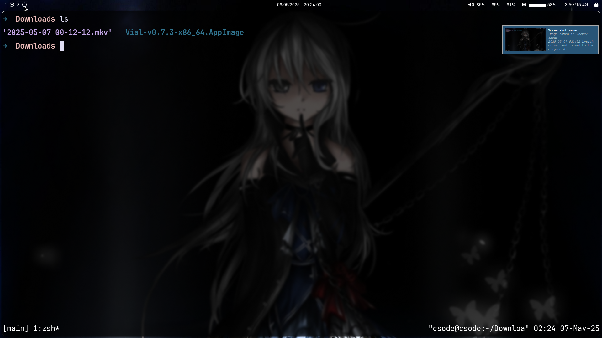
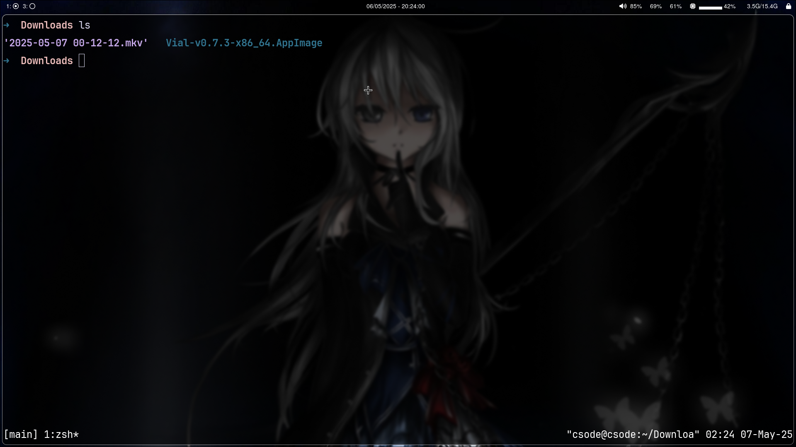

# Devenv




A personal dotfile manager for a Wayland-based development environment, featuring Hyprland as the window manager.

## Overview

This repository contains my personal configuration files and scripts for setting up a development environment on Linux with Wayland. The setup includes:

- [Hyprland](https://wiki.hyprland.org/) window manager
- [Ghostty](https://ghostty.org/docs) terminal emulator
- [Zsh](https://www.zsh.org/) shell with custom configuration
- [Neovim](https://neovim.io/) text editor
- Various development and utility tools

## Features

- [Hyprland](https://wiki.hyprland.org/)
- [Zsh](https://www.zsh.org/)
- [Neovim](https://neovim.io/)
- [Waybar](https://github.com/Alexays/Waybar)
- [Dunst](https://dunst-project.org/)
- [CopyQ](https://hluk.github.io/CopyQ/)
- [Fastfetch](https://github.com/dylanaraps/fastfetch)
- [Rofi](https://github.com/davatorium/rofi)

## Requirements

- Arch Linux or Arch-based distribution
- Wayland compositor support
- Git
- [Paru](https://github.com/Morganamilo/paru) (AUR helper)

## Installation

1. Clone the repository:
```bash
git clone https://gitlab.com/tadihailukebe/devenv.git
```

2. Navigate to the directory:
```bash
cd devenv
```

3. Run the installation script:
```bash
bash script install base
```

This will install the base packages required for the environment.

## Usage

The installation script supports several commands:

- `bash script install base` - Install base packages
- `bash script install dev` - Install development tools
- `bash script install utility` - Install utility packages
- `bash script copy` - Copy dotfiles to their respective locations

## Configuration Structure

The configuration files are organized as follows:
- `dotfiles/` - Main configuration files
- `packages/` - Package installation scripts
- `wallpaper/` - Wallpaper images

## Note

This is a personal dotfile repository tailored to my specific setup and preferences. While you're welcome to use it as a reference, please be aware that:
- The configuration is minimal and may require adjustments for your needs
- Support for issues is limited to what I can provide based on my experience
- Pull requests are not accepted as this is a personal repository

## License

This project is for personal use only and is not distributed under any specific license.

